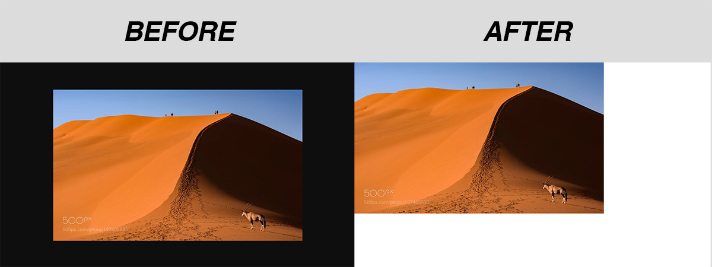

<h1 align="center">Chrome Image Uncenterer</h1>

  

<figure align="center">
  
</figure>

This is a tiny Chrome extension that reverts Chrome's image viewer back to how it was before Chrome 56. See screenshot above.

## Install

Option 1: Just install from the [Google Web Store](https://chrome.google.com/webstore/detail/olobjnglnkpmiljkdlghinhnjcdoeicl/)!

Option 2 (more advanced): You can also install the latest, unpacked version directly from this GitHub repo. Clone or download-and-unzip this repository, then click "load unpacked extension" in Google Chrome, and select the `chrome-image-uncenterer` directory you just downloaded. That's it! See [https://developer.chrome.com/extensions/getstarted#unpacked](https://developer.chrome.com/extensions/getstarted#unpacked) for step-by-step instructions on installing an unpacked extension, if you need them.

## Notes

- This was developed on Chrome for Mac OSX El Capitan, and tested briefly on Windows 8. Compatibility with other OSs is not strictly guaranteed.
- I'll keep this updated indefinitely. I use Chrome for my job and I can't get used to the stupid centered-with-black-background image viewer.
- Feel free to contribute. If you're the kind of person who reads this stuff, you're probably the kind of person who will have good stuff to add.
- Special thanks to [@jacobbaratta](https://github.com/jacobbaratta) for contributing
